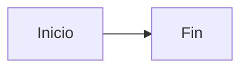

# Guía de Estilos de Notas - Orqelis 📝

Esta guía define los estándares visuales y de estructura para las notas técnicas dentro de **Orqelis**. Seguir estos estilos garantiza que el conocimiento sea legible, profesional y fácil de navegar a través del Grafo.

---

## 🏗️ 1. Estructura y Jerarquía

Todas las notas deben mantener una jerarquía clara mediante el uso de encabezados. Opcionalmente, se pueden incluir emojis para facilitar el escaneo visual.

### Encabezados
```markdown
# Título Principal (Solo uno por nota)
## 📦 Secciones Importantes
### Sub-secciones de detalle
```

### Separadores
Usa reglas horizontales para separar bloques lógicos grandes o cambios de contexto.
```markdown
---
```

---

## 🎨 2. Formato de Texto y Énfasis

El uso correcto del formato ayuda a resaltar la información crítica sin saturar al lector.

| Estilo | Markdown | Resultado | Uso Recomendado |
| :--- | :--- | :--- | :--- |
| **Negrita** | `**texto**` | **Negrita** | Enfatizar conceptos clave o términos técnicos. |
| *Itálica* | `*texto*` | *Itálica* | Notas sutiles, aclaraciones o términos en otros idiomas. |
| ~~Tachado~~ | `~~texto~~` | ~~Tachado~~ | Indicar información obsoleta o pasos descartados. |
| `Código` | `` `código` `` | `código` | Variables, comandos, archivos o pequeños fragmentos. |

---

## 💡 3. Bloques de Información y Citas

Las citas en bloque se utilizan para destacar información que requiere atención especial o decisiones de diseño.

### Notas e Importante
> **Importante**: No compartas secretos ni claves privadas en las notas.
> **Nota**: Este paso es opcional si ya tienes configurado el entorno.

### Decisiones de Arquitectura
> **ADR**: Usamos Zustand en lugar de Redux para simplificar el estado global debido a su menor boilerplate.

---

## 💻 4. Contenido Técnico y Código

Como herramienta para desarrolladores, el código es el ciudadano de primera clase.

### Bloques de Código
Especifica siempre el lenguaje para habilitar el resaltado de sintaxis (Syntax Highlighting).

````markdown
```typescript
interface Note {
  id: string;
  title: string;
  content: string;
}
```
````

### Diagramas Mermaid
Los bloques `mermaid` se convierten en diagramas y adoptan automáticamente el tema claro u oscuro de la aplicación.

````markdown

````

### Diagramas Dibujados (Excalidraw)
Además de Mermaid, puedes crear **notas de tipo diagrama** para dibujar arquitecturas, flujos o bocetos a mano alzada:

- Créalos con `Ctrl + Alt + D`, con el icono de lápiz junto a *Nueva nota* o con el comando de consola `new-diagram <título>`.
- Escribe `[[Título de nota]]` en cualquier texto del lienzo (o como enlace de un elemento con `Ctrl + K`) para conectarlo con otras notas.
- Las imágenes pegadas se guardan en el servidor, no dentro de la nota.

Úsalos desde una nota markdown así:

```markdown
El flujo completo está en [[Arquitectura del sistema]].   <!-- vínculo con vista previa -->

![[Arquitectura del sistema]]                              <!-- diagrama incrustado -->
```

- Un **vínculo** `[[...]]` a un diagrama muestra su vista previa al pasar el ratón y lo añade a la sección *Diagramas vinculados* al final de la nota.
- Una **incrustación** `![[...]]` lo dibuja dentro de la nota. En el editor, escribe `/incrustar` para insertarla.
- Los vínculos van **por título**: usa títulos claros y únicos, y actualiza los `[[...]]` si renombras un diagrama.

### Listas y Tareas
Ideal para checklists de despliegue o seguimiento de features.
- [x] Implementar autenticación JWT.
- [ ] Configurar rotación de tokens.
- [ ] Añadir auditoría de logs.

---

## 🔗 5. Enlaces y Conectividad

La potencia de Orqelis reside en cómo se conectan las ideas.

### Enlaces Bidireccionales
Usa la sintaxis de doble corchete para vincular notas. Esto creará automáticamente una conexión en el **Grafo de Conocimiento**.

```markdown
Para más detalle, consulta la [[GUIA_DESPLIEGUE]].
```

### Enlaces Externos
```markdown
[Documentación de Prisma](https://www.prisma.io/)
```

### Imágenes
Usa un texto alternativo descriptivo para mantener la nota accesible.

```markdown

```

---

## 📊 6. Tablas Técnicas

Usa tablas para comparar tecnologías, enumerar variables de entorno o definir parámetros de API.

```markdown
| Parámetro | Tipo | Descripción |
| :--- | :--- | :--- |
| `id` | UUID | Identificador único de la nota. |
| `status` | Enum | Estado de la nota (draft/published). |
| `tags` | Array | Lista de etiquetas asociadas. |
```

---

## ✅ 7. Iconografía y Estado

Utilizamos emojis específicos para denotar estados o tipos de contenido:

- ✅ **Éxito / Correcto**: Tareas completadas o buenas prácticas.
- ❌ **Error / Evitar**: Prácticas prohibidas o errores comunes.
- ⚠️ **Advertencia**: Precaución necesaria.
- 🧠 **Concepto**: Teoría o lógica compleja.
- ⚡ **Rendimiento**: Optimizaciones.
- 🔍 **Investigación**: Temas por explorar.

---

## 🏁 Notas Finales
- Usa la barra de **Formato rápido** para aplicar estilos al texto seleccionado.
- Escribe `/` para insertar plantillas y `[[` para autocompletar el título de otra nota o diagrama.
- Usa `Ctrl + Alt + N` para una nota nueva y `Ctrl + Alt + D` para un diagrama nuevo.
- Pulsa `Escape` para cerrar la guía de estilos y volver al editor.
- Mantén la consistencia con el resto de la documentación.
- No abuses de los emojis; úsalos para guiar la vista.
- Prioriza siempre la claridad sobre la decoración.

*Documento de Estándares - Orqelis 2026*
